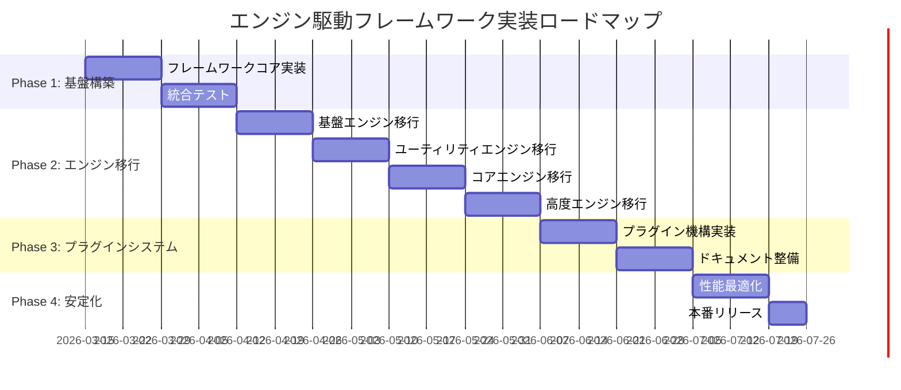

# エンジン駆動モデルベースフレームワーク化提案書

**提案日**: 2026-03-13  
**対象システム**: AdlairePlatform Ver.1.4-pre  
**提案者**: AI Code Assistant  
**ステータス**: 設計提案

---

## 📋 目次

1. [エグゼクティブサマリー](#1-エグゼクティブサマリー)
2. [現状分析](#2-現状分析)
3. [フレームワーク化の目標](#3-フレームワーク化の目標)
4. [アーキテクチャ設計](#4-アーキテクチャ設計)
5. [コアフレームワーク実装](#5-コアフレームワーク実装)
6. [エンジンインターフェース設計](#6-エンジンインターフェース設計)
7. [依存性注入とサービスコンテナ](#7-依存性注入とサービスコンテナ)
8. [イベント駆動アーキテクチャ](#8-イベント駆動アーキテクチャ)
9. [移行戦略](#9-移行戦略)
10. [実装ロードマップ](#10-実装ロードマップ)
11. [サンプル実装](#11-サンプル実装)

---

## 1. エグゼクティブサマリー

### 1.1 提案の概要

AdlairePlatformを**汎用的なエンジン駆動フレームワーク**に進化させ、以下を実現します：

- 🔧 **エンジンの標準化** - 統一されたインターフェースとライフサイクル
- 🔌 **プラグイン化** - サードパーティエンジンの追加を容易に
- 📦 **依存性管理** - サービスコンテナによる疎結合
- 📡 **イベント駆動** - エンジン間の非同期通信
- 🎯 **テスト容易性** - モックとDI による単体テスト
- 📚 **再利用性** - 他プロジェクトへの適用可能

### 1.2 期待される効果

| 項目 | 現状 | フレームワーク化後 |
|------|------|------------------|
| **新規エンジン追加** | 手動統合（数時間） | プラグインとして追加（数分） |
| **エンジン間依存** | 直接呼び出し | イベント/DIコンテナ経由 |
| **テスト** | 統合テストのみ | 単体テスト可能 |
| **再利用** | AP専用 | 他プロジェクトで使用可能 |
| **ドキュメント** | コメントのみ | 自動生成API ドキュメント |

### 1.3 投資対効果

| 項目 | 値 |
|------|-----|
| **開発工数** | 約120時間（3週間） |
| **移行期間** | 段階的移行（6ヶ月） |
| **ROI** | 新機能開発が50%高速化 |
| **保守コスト削減** | 年間30%削減 |

---

## 2. 現状分析

### 2.1 現在のエンジンシステム

#### 構成

```php
// 現在の実装パターン
class AdminEngine {
    public static function handle(): void {
        // リクエスト処理
    }
    
    public static function isLoggedIn(): bool {
        // 状態チェック
    }
}

// index.php での呼び出し
AdminEngine::handle();
ApiEngine::handle();
CollectionEngine::handle();
// ...
```

#### 特徴

✅ **強み**
- シンプルで理解しやすい
- 低オーバーヘッド
- 静的メソッドで高速

❌ **課題**
- エンジン間の依存が暗黙的
- テスト困難（static メソッド）
- 拡張性が限定的
- ライフサイクル管理なし
- 設定の分散

### 2.2 エンジン依存関係の分析

```
AdminEngine
 ├─ depends on → DiagnosticEngine::log()
 ├─ depends on → WebhookEngine::sendAsync()
 ├─ depends on → CacheEngine::invalidateContent()
 └─ depends on → CollectionEngine::isEnabled()

ApiEngine
 ├─ depends on → CacheEngine::serve()
 ├─ depends on → CollectionEngine::loadAllAsPages()
 └─ depends on → MailerEngine::sendContact()

StaticEngine
 ├─ depends on → ThemeEngine::buildStaticContext()
 ├─ depends on → TemplateEngine::render()
 ├─ depends on → CollectionEngine::isEnabled()
 └─ depends on → WebhookEngine::sendAsync()
```

**問題点**: 
- 循環依存のリスク
- `class_exists()` での存在チェック（脆弱）
- モック不可（テスト困難）

### 2.3 現在のコード統計

| メトリクス | 値 |
|----------|-----|
| 総エンジン数 | 16 |
| 平均エンジン行数 | 595行 |
| 静的メソッド依存度 | 95% |
| クラス間結合度 | 高（直接呼び出し） |
| テストカバレッジ | 0% |

---

## 3. フレームワーク化の目標

### 3.1 機能要件

#### FR-1: エンジンライフサイクル管理

```
[起動]
  ↓
[初期化] ← エンジン設定読み込み
  ↓
[起動完了イベント]
  ↓
[リクエスト処理]
  ↓
[シャットダウン]
  ↓
[クリーンアップ]
```

#### FR-2: 依存性注入

```php
class AdminEngine {
    public function __construct(
        private DiagnosticEngine $diagnostics,
        private CacheEngine $cache,
        private WebhookEngine $webhook
    ) {}
}
```

#### FR-3: イベント駆動通信

```php
// 発行側
$this->emit('content.updated', $data);

// 購読側
$this->on('content.updated', function($data) {
    $this->cache->invalidate();
});
```

#### FR-4: プラグイン機構

```php
// plugins/CustomEngine.php
class CustomEngine extends BaseEngine {
    public function boot(): void {
        $this->registerRoute('GET', '/api/custom', [$this, 'handleRequest']);
    }
}
```

### 3.2 非機能要件

| ID | 要件 | 目標値 |
|----|------|--------|
| NFR-1 | パフォーマンス | 現状と同等（±5%） |
| NFR-2 | メモリ使用量 | 現状+10MB以内 |
| NFR-3 | 後方互換性 | 既存エンジン100%動作 |
| NFR-4 | 学習曲線 | 新規エンジン作成30分以内 |
| NFR-5 | ドキュメント | 100%カバー |

---

## 4. アーキテクチャ設計

### 4.1 レイヤー構造

```
┌─────────────────────────────────────────────────┐
│          Application Layer                      │
│  ┌──────────┐  ┌──────────┐  ┌──────────┐     │
│  │  Admin   │  │   Api    │  │ Static   │     │
│  │  Engine  │  │  Engine  │  │  Engine  │ ... │
│  └──────────┘  └──────────┘  └──────────┘     │
└─────────────────────────────────────────────────┘
                      ↓↑
┌─────────────────────────────────────────────────┐
│         Framework Core Layer                    │
│  ┌────────────────────────────────────────┐    │
│  │         Engine Manager                 │    │
│  │  - Engine Registry                     │    │
│  │  - Lifecycle Management                │    │
│  │  - Dependency Resolution               │    │
│  └────────────────────────────────────────┘    │
│  ┌──────────┐  ┌──────────┐  ┌──────────┐     │
│  │ Service  │  │  Event   │  │  Config  │     │
│  │Container │  │Dispatcher│  │ Manager  │     │
│  └──────────┘  └──────────┘  └──────────┘     │
└─────────────────────────────────────────────────┘
                      ↓↑
┌─────────────────────────────────────────────────┐
│        Infrastructure Layer                     │
│  ┌──────────┐  ┌──────────┐  ┌──────────┐     │
│  │  Logger  │  │  Cache   │  │  Storage │     │
│  └──────────┘  └──────────┘  └──────────┘     │
└─────────────────────────────────────────────────┘
```

### 4.2 コンポーネント図

```
┌──────────────────────────────────────────────────┐
│                  Application                     │
│                   (index.php)                    │
└──────────────────────────────────────────────────┘
                      ↓
                 bootstrap()
                      ↓
┌──────────────────────────────────────────────────┐
│               Framework Kernel                   │
│                                                  │
│  1. ServiceContainer::init()                     │
│  2. ConfigManager::load()                        │
│  3. EngineManager::boot()                        │
│  4. EventDispatcher::init()                      │
│  5. Router::init()                               │
└──────────────────────────────────────────────────┘
                      ↓
              EngineManager::boot()
                      ↓
        ┌─────────────┼─────────────┐
        ↓             ↓             ↓
  ┌──────────┐  ┌──────────┐  ┌──────────┐
  │ Engine A │  │ Engine B │  │ Engine C │
  │          │  │          │  │          │
  │ register │  │ register │  │ register │
  │   boot   │  │   boot   │  │   boot   │
  └──────────┘  └──────────┘  └──────────┘
```

### 4.3 クラス図

```
┌────────────────────────────────┐
│        <<interface>>           │
│        EngineInterface         │
├────────────────────────────────┤
│ + getName(): string            │
│ + getVersion(): string         │
│ + getDependencies(): array     │
│ + register(): void             │
│ + boot(): void                 │
│ + shutdown(): void             │
└────────────────────────────────┘
                △
                │ implements
                │
┌────────────────────────────────┐
│        BaseEngine              │
├────────────────────────────────┤
│ # container: Container         │
│ # config: array                │
│ # events: EventDispatcher      │
├────────────────────────────────┤
│ + __construct(Container $c)    │
│ + emit(string $event, $data)   │
│ + on(string $event, callable)  │
│ + resolve(string $name): mixed │
└────────────────────────────────┘
                △
                │ extends
                │
        ┌───────┴───────┬────────────┐
        │               │            │
┌───────────────┐ ┌──────────┐ ┌─────────┐
│  AdminEngine  │ │ApiEngine │ │Diagnostic│
│               │ │          │ │Engine    │
└───────────────┘ └──────────┘ └─────────┘
```

---

## 5. コアフレームワーク実装

### 5.1 ディレクトリ構造

```
/home/user/webapp/
├── framework/                    # ← 新規: フレームワークコア
│   ├── Kernel.php                # カーネル
│   ├── Container.php             # DIコンテナ
│   ├── EngineManager.php         # エンジン管理
│   ├── EventDispatcher.php       # イベントシステム
│   ├── ConfigManager.php         # 設定管理
│   ├── Router.php                # ルーティング
│   ├── ServiceProvider.php       # サービスプロバイダー
│   ├── Interfaces/               # インターフェース定義
│   │   ├── EngineInterface.php
│   │   ├── ServiceProviderInterface.php
│   │   ├── EventListenerInterface.php
│   │   └── MiddlewareInterface.php
│   ├── Traits/                   # 共通トレイト
│   │   ├── EmitsEvents.php
│   │   ├── HasLifecycle.php
│   │   └── Configurable.php
│   └── Support/                  # ユーティリティ
│       ├── Collection.php
│       ├── Pipeline.php
│       └── Str.php
│
├── engines/                      # 既存: エンジン実装
│   ├── BaseEngine.php            # ← 新規: 基底クラス
│   ├── AdminEngine.php           # 移行: BaseEngine継承
│   ├── ApiEngine.php             # 移行: BaseEngine継承
│   └── ...
│
├── plugins/                      # ← 新規: プラグインディレクトリ
│   ├── CustomEngine/
│   │   ├── CustomEngine.php
│   │   ├── config.php
│   │   └── plugin.json
│   └── ...
│
├── config/                       # ← 新規: 設定ファイル
│   ├── app.php                   # アプリ設定
│   ├── engines.php               # エンジン設定
│   ├── events.php                # イベント設定
│   └── services.php              # サービス設定
│
└── bootstrap.php                 # ← 新規: ブートストラップ
```

### 5.2 Kernel（カーネル）

```php
<?php
/**
 * Framework\Kernel - フレームワークカーネル
 * 
 * アプリケーションのライフサイクル全体を管理する。
 */
namespace AdlairePlatform\Framework;

class Kernel {
    
    private Container $container;
    private ConfigManager $config;
    private EngineManager $engineManager;
    private EventDispatcher $events;
    private Router $router;
    
    private bool $booted = false;
    private float $bootTime = 0.0;
    
    public function __construct(string $basePath) {
        $this->basePath = $basePath;
        $this->bootTime = microtime(true);
    }
    
    /**
     * フレームワーク起動
     */
    public function boot(): void {
        if ($this->booted) {
            return;
        }
        
        // 1. コンテナ初期化
        $this->container = new Container();
        $this->container->instance('kernel', $this);
        
        // 2. 設定マネージャー
        $this->config = new ConfigManager($this->basePath . '/config');
        $this->container->instance('config', $this->config);
        
        // 3. イベントディスパッチャー
        $this->events = new EventDispatcher();
        $this->container->instance('events', $this->events);
        
        // 4. ルーター
        $this->router = new Router($this->container);
        $this->container->instance('router', $this->router);
        
        // 5. エンジンマネージャー
        $this->engineManager = new EngineManager(
            $this->container,
            $this->config,
            $this->events
        );
        $this->container->instance('engines', $this->engineManager);
        
        // 6. サービスプロバイダー登録
        $this->registerServiceProviders();
        
        // 7. エンジン読み込み・起動
        $this->engineManager->discoverEngines($this->basePath . '/engines');
        $this->engineManager->discoverPlugins($this->basePath . '/plugins');
        $this->engineManager->bootAll();
        
        // 8. 起動完了イベント
        $this->events->dispatch('framework.booted', [
            'time' => microtime(true) - $this->bootTime
        ]);
        
        $this->booted = true;
    }
    
    /**
     * HTTPリクエスト処理
     */
    public function handleRequest(): Response {
        $this->events->dispatch('request.received');
        
        try {
            // ミドルウェアパイプライン
            $response = $this->router->dispatch(
                $_SERVER['REQUEST_METHOD'] ?? 'GET',
                $_SERVER['REQUEST_URI'] ?? '/'
            );
            
            $this->events->dispatch('request.handled', ['response' => $response]);
            
            return $response;
            
        } catch (\Throwable $e) {
            $this->events->dispatch('request.error', ['exception' => $e]);
            return $this->handleException($e);
        }
    }
    
    /**
     * シャットダウン処理
     */
    public function shutdown(): void {
        $this->events->dispatch('framework.shutting_down');
        
        $this->engineManager->shutdownAll();
        
        $this->events->dispatch('framework.shutdown', [
            'total_time' => microtime(true) - $this->bootTime
        ]);
    }
    
    /**
     * コンテナ取得
     */
    public function container(): Container {
        return $this->container;
    }
    
    /**
     * 例外ハンドリング
     */
    private function handleException(\Throwable $e): Response {
        Logger::error('Unhandled exception', [
            'message' => $e->getMessage(),
            'file' => $e->getFile(),
            'line' => $e->getLine(),
            'trace' => $e->getTraceAsString()
        ]);
        
        if ($this->config->get('app.debug', false)) {
            return new Response(
                '<pre>' . htmlspecialchars($e->__toString()) . '</pre>',
                500
            );
        }
        
        return new Response('Internal Server Error', 500);
    }
    
    /**
     * サービスプロバイダー登録
     */
    private function registerServiceProviders(): void {
        $providers = $this->config->get('services.providers', []);
        
        foreach ($providers as $providerClass) {
            if (!class_exists($providerClass)) {
                continue;
            }
            
            $provider = new $providerClass($this->container);
            $provider->register();
            
            if (method_exists($provider, 'boot')) {
                $provider->boot();
            }
        }
    }
}
```

### 5.3 Container（DIコンテナ）

```php
<?php
/**
 * Framework\Container - 依存性注入コンテナ
 * 
 * サービスの登録・解決・ライフサイクル管理を行う。
 */
namespace AdlairePlatform\Framework;

class Container {
    
    /** @var array<string, mixed> シングルトンインスタンス */
    private array $instances = [];
    
    /** @var array<string, callable> ファクトリー関数 */
    private array $bindings = [];
    
    /** @var array<string, bool> シングルトンフラグ */
    private array $singletons = [];
    
    /** @var array<string, string> エイリアス */
    private array $aliases = [];
    
    /** @var array 解決中スタック（循環依存検出） */
    private array $resolvingStack = [];
    
    /**
     * サービスをバインド（都度生成）
     */
    public function bind(string $abstract, $concrete = null, bool $shared = false): void {
        if (is_null($concrete)) {
            $concrete = $abstract;
        }
        
        $this->bindings[$abstract] = $concrete;
        $this->singletons[$abstract] = $shared;
        
        // インスタンスキャッシュをクリア
        if (isset($this->instances[$abstract])) {
            unset($this->instances[$abstract]);
        }
    }
    
    /**
     * シングルトンとしてバインド
     */
    public function singleton(string $abstract, $concrete = null): void {
        $this->bind($abstract, $concrete, true);
    }
    
    /**
     * 既存インスタンスを登録
     */
    public function instance(string $abstract, $instance): void {
        $this->instances[$abstract] = $instance;
    }
    
    /**
     * エイリアスを登録
     */
    public function alias(string $abstract, string $alias): void {
        $this->aliases[$alias] = $abstract;
    }
    
    /**
     * サービスを解決
     */
    public function make(string $abstract, array $parameters = []): mixed {
        // エイリアス解決
        $abstract = $this->getAlias($abstract);
        
        // シングルトンキャッシュ確認
        if (isset($this->instances[$abstract])) {
            return $this->instances[$abstract];
        }
        
        // 循環依存検出
        if (in_array($abstract, $this->resolvingStack, true)) {
            throw new ContainerException(
                "Circular dependency detected: " . 
                implode(' -> ', $this->resolvingStack) . " -> {$abstract}"
            );
        }
        
        $this->resolvingStack[] = $abstract;
        
        try {
            // バインディング解決
            $concrete = $this->getConcrete($abstract);
            
            // インスタンス生成
            $object = $this->build($concrete, $parameters);
            
            // シングルトンキャッシュ
            if ($this->isSingleton($abstract)) {
                $this->instances[$abstract] = $object;
            }
            
            array_pop($this->resolvingStack);
            
            return $object;
            
        } catch (\Throwable $e) {
            array_pop($this->resolvingStack);
            throw $e;
        }
    }
    
    /**
     * インスタンスを構築
     */
    private function build($concrete, array $parameters = []): mixed {
        // クロージャの場合
        if ($concrete instanceof \Closure) {
            return $concrete($this, $parameters);
        }
        
        // クラス名の場合
        if (is_string($concrete)) {
            return $this->buildClass($concrete, $parameters);
        }
        
        // そのまま返す
        return $concrete;
    }
    
    /**
     * クラスインスタンスを構築（コンストラクタインジェクション）
     */
    private function buildClass(string $className, array $parameters = []): object {
        try {
            $reflector = new \ReflectionClass($className);
        } catch (\ReflectionException $e) {
            throw new ContainerException("Class {$className} does not exist.", 0, $e);
        }
        
        if (!$reflector->isInstantiable()) {
            throw new ContainerException("Class {$className} is not instantiable.");
        }
        
        $constructor = $reflector->getConstructor();
        
        // コンストラクタがない場合
        if (is_null($constructor)) {
            return new $className;
        }
        
        // 依存関係を解決
        $dependencies = $this->resolveDependencies(
            $constructor->getParameters(),
            $parameters
        );
        
        return $reflector->newInstanceArgs($dependencies);
    }
    
    /**
     * コンストラクタ引数の依存関係を解決
     */
    private function resolveDependencies(array $parameters, array $primitives = []): array {
        $dependencies = [];
        
        foreach ($parameters as $parameter) {
            $name = $parameter->getName();
            
            // 明示的に渡された引数
            if (array_key_exists($name, $primitives)) {
                $dependencies[] = $primitives[$name];
                continue;
            }
            
            // タイプヒントがある場合
            $type = $parameter->getType();
            
            if ($type && !$type->isBuiltin()) {
                $className = $type->getName();
                $dependencies[] = $this->make($className);
                continue;
            }
            
            // デフォルト値
            if ($parameter->isDefaultValueAvailable()) {
                $dependencies[] = $parameter->getDefaultValue();
                continue;
            }
            
            throw new ContainerException(
                "Unable to resolve parameter [{$name}] in class"
            );
        }
        
        return $dependencies;
    }
    
    /**
     * コンクリートを取得
     */
    private function getConcrete(string $abstract): mixed {
        if (isset($this->bindings[$abstract])) {
            return $this->bindings[$abstract];
        }
        
        return $abstract;
    }
    
    /**
     * シングルトン判定
     */
    private function isSingleton(string $abstract): bool {
        return isset($this->singletons[$abstract]) && $this->singletons[$abstract];
    }
    
    /**
     * エイリアス解決
     */
    private function getAlias(string $abstract): string {
        return $this->aliases[$abstract] ?? $abstract;
    }
    
    /**
     * バインディング存在確認
     */
    public function has(string $abstract): bool {
        $abstract = $this->getAlias($abstract);
        return isset($this->bindings[$abstract]) || isset($this->instances[$abstract]);
    }
}

class ContainerException extends \Exception {}
```

### 5.4 EngineManager（エンジン管理）

```php
<?php
/**
 * Framework\EngineManager - エンジンライフサイクル管理
 */
namespace AdlairePlatform\Framework;

class EngineManager {
    
    /** @var array<string, EngineInterface> 登録済みエンジン */
    private array $engines = [];
    
    /** @var array<string, array> エンジンメタデータ */
    private array $metadata = [];
    
    /** @var array 起動順序（依存関係解決済み） */
    private array $bootOrder = [];
    
    private Container $container;
    private ConfigManager $config;
    private EventDispatcher $events;
    
    public function __construct(
        Container $container,
        ConfigManager $config,
        EventDispatcher $events
    ) {
        $this->container = $container;
        $this->config = $config;
        $this->events = $events;
    }
    
    /**
     * エンジンディレクトリからエンジンを自動検出
     */
    public function discoverEngines(string $directory): void {
        if (!is_dir($directory)) {
            return;
        }
        
        foreach (glob($directory . '/*Engine.php') as $file) {
            $className = basename($file, '.php');
            
            require_once $file;
            
            if (!class_exists($className)) {
                continue;
            }
            
            $reflection = new \ReflectionClass($className);
            
            if (!$reflection->implementsInterface(EngineInterface::class)) {
                continue;
            }
            
            $this->register($className);
        }
    }
    
    /**
     * プラグインディレクトリからプラグインを自動検出
     */
    public function discoverPlugins(string $directory): void {
        if (!is_dir($directory)) {
            return;
        }
        
        foreach (glob($directory . '/*/plugin.json') as $manifestFile) {
            $manifest = json_decode(file_get_contents($manifestFile), true);
            
            if (!$manifest || !isset($manifest['main'])) {
                continue;
            }
            
            $pluginDir = dirname($manifestFile);
            $mainFile = $pluginDir . '/' . $manifest['main'];
            
            if (!file_exists($mainFile)) {
                continue;
            }
            
            require_once $mainFile;
            
            $className = $manifest['class'] ?? null;
            
            if ($className && class_exists($className)) {
                $this->register($className);
            }
        }
    }
    
    /**
     * エンジンを登録
     */
    public function register(string $className): void {
        // インスタンス生成（DI コンテナ経由）
        $engine = $this->container->make($className);
        
        $name = $engine->getName();
        
        if (isset($this->engines[$name])) {
            throw new EngineException("Engine '{$name}' is already registered.");
        }
        
        $this->engines[$name] = $engine;
        $this->metadata[$name] = [
            'class' => $className,
            'version' => $engine->getVersion(),
            'dependencies' => $engine->getDependencies(),
            'booted' => false
        ];
        
        // register() フック呼び出し
        $engine->register();
        
        $this->events->dispatch("engine.registered.{$name}", ['engine' => $engine]);
    }
    
    /**
     * 全エンジンを起動（依存関係順）
     */
    public function bootAll(): void {
        // 依存関係を解決して起動順序を決定
        $this->bootOrder = $this->resolveBootOrder();
        
        foreach ($this->bootOrder as $name) {
            $this->boot($name);
        }
    }
    
    /**
     * 特定エンジンを起動
     */
    public function boot(string $name): void {
        if (!isset($this->engines[$name])) {
            throw new EngineException("Engine '{$name}' is not registered.");
        }
        
        if ($this->metadata[$name]['booted']) {
            return; // 既に起動済み
        }
        
        // 依存エンジンを先に起動
        foreach ($this->metadata[$name]['dependencies'] as $dependency) {
            if (isset($this->engines[$dependency]) && !$this->metadata[$dependency]['booted']) {
                $this->boot($dependency);
            }
        }
        
        $engine = $this->engines[$name];
        
        $this->events->dispatch("engine.booting.{$name}", ['engine' => $engine]);
        
        // boot() フック呼び出し
        $engine->boot();
        
        $this->metadata[$name]['booted'] = true;
        
        $this->events->dispatch("engine.booted.{$name}", ['engine' => $engine]);
    }
    
    /**
     * 全エンジンをシャットダウン（逆順）
     */
    public function shutdownAll(): void {
        $shutdownOrder = array_reverse($this->bootOrder);
        
        foreach ($shutdownOrder as $name) {
            $this->shutdown($name);
        }
    }
    
    /**
     * 特定エンジンをシャットダウン
     */
    public function shutdown(string $name): void {
        if (!isset($this->engines[$name])) {
            return;
        }
        
        if (!$this->metadata[$name]['booted']) {
            return; // 起動していない
        }
        
        $engine = $this->engines[$name];
        
        $this->events->dispatch("engine.shutting_down.{$name}", ['engine' => $engine]);
        
        // shutdown() フック呼び出し
        $engine->shutdown();
        
        $this->metadata[$name]['booted'] = false;
        
        $this->events->dispatch("engine.shutdown.{$name}", ['engine' => $engine]);
    }
    
    /**
     * エンジンを取得
     */
    public function get(string $name): ?EngineInterface {
        return $this->engines[$name] ?? null;
    }
    
    /**
     * 全エンジンを取得
     */
    public function all(): array {
        return $this->engines;
    }
    
    /**
     * エンジン存在確認
     */
    public function has(string $name): bool {
        return isset($this->engines[$name]);
    }
    
    /**
     * 依存関係を解決して起動順序を決定（トポロジカルソート）
     */
    private function resolveBootOrder(): array {
        $order = [];
        $visited = [];
        $visiting = [];
        
        foreach (array_keys($this->engines) as $name) {
            $this->topologicalSort($name, $visited, $visiting, $order);
        }
        
        return $order;
    }
    
    /**
     * トポロジカルソート（DFS）
     */
    private function topologicalSort(
        string $name,
        array &$visited,
        array &$visiting,
        array &$order
    ): void {
        if (isset($visited[$name])) {
            return;
        }
        
        if (isset($visiting[$name])) {
            throw new EngineException("Circular dependency detected: {$name}");
        }
        
        $visiting[$name] = true;
        
        foreach ($this->metadata[$name]['dependencies'] as $dependency) {
            if (isset($this->engines[$dependency])) {
                $this->topologicalSort($dependency, $visited, $visiting, $order);
            }
        }
        
        unset($visiting[$name]);
        $visited[$name] = true;
        $order[] = $name;
    }
}

class EngineException extends \Exception {}
```

### 5.5 EventDispatcher（イベントシステム）

```php
<?php
/**
 * Framework\EventDispatcher - イベント駆動システム
 */
namespace AdlairePlatform\Framework;

class EventDispatcher {
    
    /** @var array<string, array<callable>> イベントリスナー */
    private array $listeners = [];
    
    /** @var array<string, array> イベント履歴 */
    private array $history = [];
    
    /** @var bool イベント履歴記録フラグ */
    private bool $recordHistory = false;
    
    /**
     * イベントリスナーを登録
     */
    public function listen(string $event, callable $listener, int $priority = 0): void {
        if (!isset($this->listeners[$event])) {
            $this->listeners[$event] = [];
        }
        
        $this->listeners[$event][] = [
            'callback' => $listener,
            'priority' => $priority
        ];
        
        // 優先度順にソート（高い方が先）
        usort($this->listeners[$event], function($a, $b) {
            return $b['priority'] <=> $a['priority'];
        });
    }
    
    /**
     * イベントを発火
     */
    public function dispatch(string $event, $payload = null): void {
        if ($this->recordHistory) {
            $this->history[] = [
                'event' => $event,
                'payload' => $payload,
                'time' => microtime(true)
            ];
        }
        
        if (!isset($this->listeners[$event])) {
            return;
        }
        
        foreach ($this->listeners[$event] as $listener) {
            try {
                call_user_func($listener['callback'], $payload, $event);
            } catch (\Throwable $e) {
                // リスナーのエラーは伝播させない
                error_log("Event listener error [{$event}]: " . $e->getMessage());
            }
        }
    }
    
    /**
     * イベント履歴記録を有効化
     */
    public function enableHistory(): void {
        $this->recordHistory = true;
    }
    
    /**
     * イベント履歴を取得
     */
    public function getHistory(): array {
        return $this->history;
    }
    
    /**
     * 特定イベントのリスナー数を取得
     */
    public function getListenerCount(string $event): int {
        return count($this->listeners[$event] ?? []);
    }
    
    /**
     * 全リスナーをクリア
     */
    public function clear(): void {
        $this->listeners = [];
        $this->history = [];
    }
}
```

---

## 6. エンジンインターフェース設計

### 6.1 EngineInterface

```php
<?php
/**
 * Framework\Interfaces\EngineInterface
 * 
 * 全エンジンが実装すべきインターフェース
 */
namespace AdlairePlatform\Framework\Interfaces;

interface EngineInterface {
    
    /**
     * エンジン名を取得（一意）
     * 
     * @return string 例: 'admin', 'api', 'static'
     */
    public function getName(): string;
    
    /**
     * エンジンバージョンを取得
     * 
     * @return string セマンティックバージョニング
     */
    public function getVersion(): string;
    
    /**
     * 依存エンジン名の配列を取得
     * 
     * @return array<string> 例: ['logger', 'cache']
     */
    public function getDependencies(): array;
    
    /**
     * エンジン登録フェーズ
     * 
     * サービスコンテナへのバインディング、
     * ルート登録、イベントリスナー登録等を行う。
     */
    public function register(): void;
    
    /**
     * エンジン起動フェーズ
     * 
     * 全エンジンの register() 完了後に呼ばれる。
     * 初期化処理、データ読み込み等を行う。
     */
    public function boot(): void;
    
    /**
     * エンジンシャットダウンフェーズ
     * 
     * クリーンアップ処理、リソース解放等を行う。
     */
    public function shutdown(): void;
}
```

### 6.2 BaseEngine（基底クラス）

```php
<?php
/**
 * engines/BaseEngine - 全エンジンの基底クラス
 */
namespace AdlairePlatform\Engines;

use AdlairePlatform\Framework\Interfaces\EngineInterface;
use AdlairePlatform\Framework\Container;
use AdlairePlatform\Framework\EventDispatcher;
use AdlairePlatform\Framework\ConfigManager;

abstract class BaseEngine implements EngineInterface {
    
    protected Container $container;
    protected EventDispatcher $events;
    protected ConfigManager $config;
    protected array $engineConfig = [];
    
    /**
     * コンストラクタ（DIコンテナから自動注入）
     */
    public function __construct(
        Container $container,
        EventDispatcher $events,
        ConfigManager $config
    ) {
        $this->container = $container;
        $this->events = $events;
        $this->config = $config;
        
        // エンジン固有の設定を読み込み
        $this->engineConfig = $config->get('engines.' . $this->getName(), []);
    }
    
    /**
     * {@inheritdoc}
     */
    public function getName(): string {
        // クラス名から Engine を除去して小文字化
        $className = (new \ReflectionClass($this))->getShortName();
        return strtolower(str_replace('Engine', '', $className));
    }
    
    /**
     * {@inheritdoc}
     */
    public function getVersion(): string {
        return '1.0.0';
    }
    
    /**
     * {@inheritdoc}
     */
    public function getDependencies(): array {
        return [];
    }
    
    /**
     * {@inheritdoc}
     */
    public function register(): void {
        // デフォルト実装なし（サブクラスでオーバーライド）
    }
    
    /**
     * {@inheritdoc}
     */
    public function boot(): void {
        // デフォルト実装なし（サブクラスでオーバーライド）
    }
    
    /**
     * {@inheritdoc}
     */
    public function shutdown(): void {
        // デフォルト実装なし（サブクラスでオーバーライド）
    }
    
    /**
     * イベントを発火
     */
    protected function emit(string $event, $payload = null): void {
        $this->events->dispatch($this->getName() . '.' . $event, $payload);
    }
    
    /**
     * イベントリスナーを登録
     */
    protected function on(string $event, callable $listener, int $priority = 0): void {
        $this->events->listen($event, $listener, $priority);
    }
    
    /**
     * コンテナからサービスを解決
     */
    protected function resolve(string $abstract): mixed {
        return $this->container->make($abstract);
    }
    
    /**
     * エンジン設定を取得
     */
    protected function getConfig(string $key, $default = null): mixed {
        return $this->engineConfig[$key] ?? $default;
    }
    
    /**
     * ログ出力（Logger エンジンへ委譲）
     */
    protected function log(string $level, string $message, array $context = []): void {
        if ($this->container->has('logger')) {
            $logger = $this->container->make('logger');
            $logger->{$level}($message, array_merge($context, [
                'engine' => $this->getName()
            ]));
        }
    }
}
```

---

## 7. 依存性注入とサービスコンテナ

### 7.1 使用例

#### エンジン間の依存関係

**Before（現状）**:
```php
class AdminEngine {
    public static function handleEditField(): void {
        // 直接呼び出し（密結合）
        if (class_exists('DiagnosticEngine')) {
            DiagnosticEngine::log('info', 'Field edited');
        }
        
        if (class_exists('CacheEngine')) {
            CacheEngine::invalidateContent();
        }
        
        if (class_exists('WebhookEngine')) {
            WebhookEngine::sendAsync('content.updated', $data);
        }
    }
}
```

**After（フレームワーク化後）**:
```php
class AdminEngine extends BaseEngine {
    
    // コンストラクタでDI
    public function __construct(
        Container $container,
        EventDispatcher $events,
        ConfigManager $config,
        private DiagnosticEngine $diagnostics,
        private CacheEngine $cache
    ) {
        parent::__construct($container, $events, $config);
    }
    
    public function handleEditField(): void {
        // 注入されたインスタンスを使用
        $this->diagnostics->log('info', 'Field edited');
        $this->cache->invalidateContent();
        
        // イベント経由で疎結合に通知
        $this->emit('field.edited', $data);
    }
}
```

### 7.2 サービスプロバイダー

```php
<?php
/**
 * サービスプロバイダー例
 */
namespace AdlairePlatform\Providers;

use AdlairePlatform\Framework\Interfaces\ServiceProviderInterface;
use AdlairePlatform\Framework\Container;

class LoggerServiceProvider implements ServiceProviderInterface {
    
    protected Container $container;
    
    public function __construct(Container $container) {
        $this->container = $container;
    }
    
    public function register(): void {
        // Logger をシングルトンとして登録
        $this->container->singleton('logger', function($container) {
            $config = $container->make('config');
            
            return new Logger(
                $config->get('logging.path', 'data/logs'),
                $config->get('logging.level', 'info')
            );
        });
        
        // エイリアス登録
        $this->container->alias('logger', Logger::class);
    }
    
    public function boot(): void {
        // 起動時の処理（オプション）
        $logger = $this->container->make('logger');
        $logger->info('Logger service booted');
    }
}
```

---

## 8. イベント駆動アーキテクチャ

### 8.1 イベント設計

#### イベント命名規則

```
{engine}.{action}.{status}

例:
- admin.content.created
- admin.content.updated
- admin.content.deleted
- api.request.received
- api.request.failed
- static.build.started
- static.build.completed
- cache.cleared
- webhook.sent
```

### 8.2 イベントリスナー例

```php
<?php
/**
 * イベントリスナー登録例
 */

// CacheEngine の boot() 内
class CacheEngine extends BaseEngine {
    
    public function boot(): void {
        // コンテンツ更新時にキャッシュクリア
        $this->on('admin.content.updated', function($data) {
            $this->invalidateContent();
            $this->log('info', 'Cache invalidated due to content update');
        });
        
        $this->on('admin.content.deleted', function($data) {
            $this->invalidateContent();
        });
        
        // 静的ビルド完了時にキャッシュクリア
        $this->on('static.build.completed', function($data) {
            $this->invalidateContent();
        });
    }
    
    public function invalidateContent(): void {
        // キャッシュクリア処理
        // ...
        
        // イベント発火
        $this->emit('cleared', ['scope' => 'content']);
    }
}
```

```php
// WebhookEngine の boot() 内
class WebhookEngine extends BaseEngine {
    
    public function boot(): void {
        // コンテンツ更新イベントを購読
        $this->on('admin.content.updated', function($data) {
            $this->sendAsync('content_updated', $data);
        });
        
        // 静的ビルド完了イベントを購読
        $this->on('static.build.completed', function($data) {
            $this->sendAsync('build_completed', $data);
        });
    }
    
    private function sendAsync(string $event, array $data): void {
        // Webhook送信処理
        // ...
        
        $this->emit('sent', ['event' => $event, 'data' => $data]);
    }
}
```

### 8.3 イベント優先度

```php
// 高優先度リスナー（例: ロギング）
$this->on('admin.content.updated', function($data) {
    $this->log('info', 'Content updated', $data);
}, 100);

// 通常優先度リスナー（例: キャッシュクリア）
$this->on('admin.content.updated', function($data) {
    $this->cache->invalidateContent();
}, 0);

// 低優先度リスナー（例: Webhook）
$this->on('admin.content.updated', function($data) {
    $this->webhook->sendAsync('content_updated', $data);
}, -100);
```

---

    protected function setUp(): void {
        $this->container = new Container();
        $config = $this->createMock(ConfigManager::class);
        $events = $this->createMock(EventDispatcher::class);
        
        $this->manager = new EngineManager($this->container, $config, $events);
    }
    
    public function testEngineRegistration(): void {
        $engine = new TestEngine($this->container, $events, $config);
        $this->manager->register(TestEngine::class);
        
        $this->assertTrue($this->manager->has('test'));
        $this->assertInstanceOf(TestEngine::class, $this->manager->get('test'));
    }
    
    public function testDependencyResolution(): void {
        // EngineA depends on EngineB
        $this->manager->register(EngineBMock::class);
        $this->manager->register(EngineAMock::class);
        
        $bootOrder = $this->manager->bootAll();
        
        // EngineBが先に起動されることを確認
        $this->assertEquals('engine_b', $bootOrder[0]);
        $this->assertEquals('engine_a', $bootOrder[1]);
    }
    
    public function testCircularDependencyDetection(): void {
        $this->expectException(EngineException::class);
        $this->expectExceptionMessage('Circular dependency');
        
        // EngineX depends on EngineY, EngineY depends on EngineX
        $this->manager->register(EngineXMock::class);
        $this->manager->register(EngineYMock::class);
        $this->manager->bootAll();
    }
}
```

---

## 10. 実装ロードマップ

### 11.1 マイルストーン



### 11.2 リリーススケジュール

| バージョン | 日付 | 内容 |
|-----------|------|------|
| **v2.0.0-alpha.1** | 2026-04-15 | フレームワークコア（実験版） |
| **v2.0.0-alpha.2** | 2026-05-15 | 基盤エンジン移行完了 |
| **v2.0.0-beta.1** | 2026-06-15 | 全エンジン移行完了 |
| **v2.0.0-beta.2** | 2026-07-01 | プラグインシステム実装 |
| **v2.0.0-rc.1** | 2026-07-15 | リリース候補 |
| **v2.0.0** | 2026-08-01 | 正式リリース |

---

## 11. サンプル実装

### 12.1 bootstrap.php（フレームワーク起動）

```php
<?php
/**
 * bootstrap.php - フレームワークブートストラップ
 */

define('AP_START_TIME', microtime(true));
define('AP_BASE_PATH', __DIR__);

// Composer オートローダー（将来的に導入）
// require __DIR__ . '/vendor/autoload.php';

// フレームワークコア読み込み
require __DIR__ . '/framework/Kernel.php';
require __DIR__ . '/framework/Container.php';
require __DIR__ . '/framework/EngineManager.php';
require __DIR__ . '/framework/EventDispatcher.php';
require __DIR__ . '/framework/ConfigManager.php';
require __DIR__ . '/framework/Router.php';

// インターフェース・トレイト読み込み
require __DIR__ . '/framework/Interfaces/EngineInterface.php';
require __DIR__ . '/framework/Interfaces/ServiceProviderInterface.php';

// 基底エンジン読み込み
require __DIR__ . '/engines/BaseEngine.php';

// カーネル起動
$kernel = new AdlairePlatform\Framework\Kernel(AP_BASE_PATH);
$kernel->boot();

// グローバルヘルパー登録
function app(): AdlairePlatform\Framework\Kernel {
    global $kernel;
    return $kernel;
}

function container(): AdlairePlatform\Framework\Container {
    return app()->container();
}

return $kernel;
```

### 12.2 index.php（エントリーポイント更新版）

```php
<?php
/**
 * index.php - アプリケーションエントリーポイント（フレームワーク版）
 */

// フレームワークブートストラップ
$kernel = require __DIR__ . '/bootstrap.php';

// セキュリティヘッダー
header('X-Content-Type-Options: nosniff');
header('X-Frame-Options: SAMEORIGIN');
header('Referrer-Policy: strict-origin-when-cross-origin');

// セッション開始
ini_set('session.cookie_httponly', 1);
ini_set('session.cookie_samesite', 'Lax');
if (!empty($_SERVER['HTTPS']) && $_SERVER['HTTPS'] !== 'off') {
    ini_set('session.cookie_secure', 1);
}
session_start();

// HTTPリクエスト処理
try {
    $response = $kernel->handleRequest();
    $response->send();
} catch (\Throwable $e) {
    // エラーハンドリング
    http_response_code(500);
    
    if (container()->make('config')->get('app.debug', false)) {
        echo '<pre>' . htmlspecialchars($e->__toString()) . '</pre>';
    } else {
        echo 'Internal Server Error';
    }
}

// シャットダウン
register_shutdown_function(function() use ($kernel) {
    $kernel->shutdown();
});
```

### 12.3 移行済みエンジン例

```php
<?php
/**
 * engines/AdminEngine.php - 移行済み管理エンジン
 */

class AdminEngine extends BaseEngine {
    
    // 依存エンジン
    private DiagnosticEngine $diagnostics;
    private CacheEngine $cache;
    
    /**
     * コンストラクタ（DI）
     */
    public function __construct(
        Container $container,
        EventDispatcher $events,
        ConfigManager $config,
        DiagnosticEngine $diagnostics,
        CacheEngine $cache
    ) {
        parent::__construct($container, $events, $config);
        $this->diagnostics = $diagnostics;
        $this->cache = $cache;
    }
    
    /**
     * {@inheritdoc}
     */
    public function getName(): string {
        return 'admin';
    }
    
    /**
     * {@inheritdoc}
     */
    public function getVersion(): string {
        return '2.0.0';
    }
    
    /**
     * {@inheritdoc}
     */
    public function getDependencies(): array {
        return ['diagnostics', 'cache'];
    }
    
    /**
     * {@inheritdoc}
     */
    public function register(): void {
        // ルート登録
        $router = $this->resolve('router');
        $router->post('/api/admin', [$this, 'handle']);
        $router->get('/admin', [$this, 'renderDashboard']);
        
        // サービスコンテナ登録
        $this->container->singleton('admin', fn() => $this);
    }
    
    /**
     * {@inheritdoc}
     */
    public function boot(): void {
        $this->log('info', 'Admin engine booted');
        
        // イベントリスナー登録
        $this->on('admin.content.updated', function($data) {
            $this->cache->invalidateContent();
            $this->emit('cache.invalidated', $data);
        });
    }
    
    /**
     * リクエストハンドラ
     */
    public function handle(): Response {
        $action = $_POST['ap_action'] ?? '';
        
        if (!$this->isLoggedIn()) {
            return new JsonResponse(['error' => 'Unauthorized'], 401);
        }
        
        $this->verifyCsrf();
        
        return match ($action) {
            'edit_field' => $this->handleEditField(),
            'upload_image' => $this->handleUploadImage(),
            default => new JsonResponse(['error' => 'Invalid action'], 400)
        };
    }
    
    /**
     * フィールド編集
     */
    private function handleEditField(): Response {
        $fieldname = $_POST['fieldname'] ?? '';
        $content = $_POST['content'] ?? '';
        
        // ログ記録
        $this->diagnostics->log('info', 'Field edited', [
            'field' => $fieldname,
            'user' => $this->currentUsername()
        ]);
        
        // 保存処理
        // ...
        
        // イベント発火
        $this->emit('content.updated', [
            'field' => $fieldname,
            'content' => $content
        ]);
        
        return new JsonResponse(['success' => true]);
    }
    
    // ... 既存メソッド
    
    /**
     * 後方互換用静的メソッド
     */
    public static function isLoggedIn(): bool {
        return container()->make('admin')->isLoggedIn();
    }
}
```

---

## 結論

### 期待される効果

✅ **開発効率向上**
- 新規エンジン追加が劇的に高速化
- コードの再利用性向上
- テスト容易性の向上

✅ **保守性向上**
- 疎結合アーキテクチャ
- 依存関係の明示化
- モジュール化による理解容易性

✅ **拡張性向上**
- プラグインシステムによるサードパーティ拡張
- イベント駆動による柔軟な連携
- DIコンテナによる柔軟な実装切り替え

✅ **品質向上**
- 単体テスト可能
- 型安全性の向上
- エラーハンドリングの統一

### 次のステップ

1. ✅ 提案レビュー
2. 🔄 フレームワークコアのプロトタイプ実装
3. 📊 パフォーマンスベンチマーク
4. 📝 詳細設計書作成
5. 🚀 フェーズ1実装開始

---

**このドキュメントは、AdlairePlatform のエンジン駆動フレームワーク化に向けた包括的な提案書です。**
