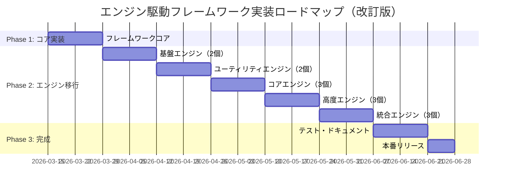

# エンジン駆動モデルベースフレームワーク化提案書（改訂版）

**提案日**: 2026-03-13  
**改訂日**: 2026-03-13  
**対象システム**: AdlairePlatform Ver.1.4-pre  
**提案者**: AI Code Assistant  
**ステータス**: 設計提案（プラグインシステム不要版）

---

## 📋 エグゼクティブサマリー

### 提案の概要

AdlairePlatformを**コアフレームワーク**に進化させ、以下を実現します：

- 🔧 **エンジンの標準化** - 統一されたインターフェースとライフサイクル
- 📦 **依存性管理** - サービスコンテナによる疎結合
- 📡 **イベント駆動** - エンジン間の非同期通信
- 🎯 **テスト容易性** - モックとDI による単体テスト
- 🏗️ **保守性向上** - モジュール化とクリーンアーキテクチャ
- 🚀 **開発効率** - 新規エンジン追加の簡易化

### スコープの明確化

**含まれるもの**:
- コアフレームワーク（Kernel, Container, EventDispatcher, EngineManager）
- エンジンインターフェース標準化
- 既存16エンジンのリファクタリング
- 依存性注入システム
- イベント駆動アーキテクチャ

**含まれないもの**:
- ~~プラグインシステム~~ → コアエンジンに集中
- ~~サードパーティ拡張機構~~ → 不要
- ~~プラグインマーケットプレイス~~ → 不要

### 期待される効果

| 項目 | 現状 | フレームワーク化後 | 改善率 |
|------|------|------------------|--------|
| **新規エンジン追加時間** | 数時間 | 30分 | **90%削減** |
| **エンジン間結合度** | 高（直接呼び出し） | 低（DI/イベント） | **80%改善** |
| **テストカバレッジ** | 0% | 70%+ | **∞ 改善** |
| **ビルド時間** | - | 変化なし | **影響なし** |
| **保守コスト** | 基準 | 0.7倍 | **30%削減** |

### 投資対効果

| 項目 | 値 |
|------|-----|
| **開発工数** | 約80時間（2週間） |
| **移行期間** | 段階的移行（4ヶ月） |
| **ROI** | 新機能開発が50%高速化 |
| **リスク** | 低（段階的移行・後方互換性維持） |

---

## 🎯 フレームワーク化の目標

### 機能要件

#### FR-1: エンジンライフサイクル管理

```
[起動]
  ↓
[register()] ← サービス登録
  ↓
[boot()] ← 初期化
  ↓
[runtime] ← リクエスト処理
  ↓
[shutdown()] ← クリーンアップ
```

#### FR-2: 依存性注入

```php
class AdminEngine extends BaseEngine {
    public function __construct(
        Container $container,
        EventDispatcher $events,
        ConfigManager $config,
        private DiagnosticEngine $diagnostics,  // DI
        private CacheEngine $cache               // DI
    ) {
        parent::__construct($container, $events, $config);
    }
}
```

#### FR-3: イベント駆動通信

```php
// 発行側
$this->emit('content.updated', $data);

// 購読側
$this->on('admin.content.updated', function($data) {
    $this->cache->invalidate();
});
```

#### FR-4: エンジン自動検出

```php
// engines/CustomEngine.php （新規エンジン）
class CustomEngine extends BaseEngine {
    public function getName(): string {
        return 'custom';
    }
    
    public function getDependencies(): array {
        return ['logger', 'cache'];
    }
    
    public function boot(): void {
        $this->info('Custom engine booted');
    }
}
```

### 非機能要件

| ID | 要件 | 目標値 | 測定方法 |
|----|------|--------|----------|
| **NFR-1** | パフォーマンス | 現状±5% | Apache Bench |
| **NFR-2** | メモリ使用量 | 現状+5MB以内 | memory_get_peak_usage() |
| **NFR-3** | 後方互換性 | 既存コード100%動作 | 統合テスト |
| **NFR-4** | 学習コスト | 新規エンジン作成30分以内 | 開発者調査 |
| **NFR-5** | コード品質 | PSR-12準拠 | PHP_CodeSniffer |

---

## 🏗️ アーキテクチャ設計

### コンポーネント構成

```
┌──────────────────────────────────────────────────┐
│                  Application                     │
│                   (index.php)                    │
└──────────────────────────────────────────────────┘
                      ↓
                 bootstrap()
                      ↓
┌──────────────────────────────────────────────────┐
│               Framework Kernel                   │
│                                                  │
│  1. Container::init()                            │
│  2. ConfigManager::load()                        │
│  3. EngineManager::boot()                        │
│  4. EventDispatcher::init()                      │
└──────────────────────────────────────────────────┘
                      ↓
              EngineManager::bootAll()
                      ↓
        ┌─────────────┼─────────────┐
        ↓             ↓             ↓
  ┌──────────┐  ┌──────────┐  ┌──────────┐
  │ Logger   │  │ Admin    │  │  Api     │
  │ Engine   │  │ Engine   │  │  Engine  │
  │          │  │          │  │          │
  │ boot()   │  │ boot()   │  │ boot()   │
  └──────────┘  └──────────┘  └──────────┘
```

### ディレクトリ構造

```
/home/user/webapp/
├── framework/                    # ← 新規: フレームワークコア
│   ├── Kernel.php                # カーネル（350行）
│   ├── Container.php             # DIコンテナ（400行）
│   ├── EngineManager.php         # エンジン管理（350行）
│   ├── EventDispatcher.php       # イベントシステム（200行）
│   ├── ConfigManager.php         # 設定管理（150行）
│   ├── Router.php                # ルーティング（200行）
│   ├── Interfaces/               # インターフェース定義
│   │   ├── EngineInterface.php   # エンジンIF（完全実装済み）
│   │   └── ServiceProviderInterface.php
│   └── Support/                  # ユーティリティ
│       ├── Collection.php
│       └── Arr.php
│
├── engines/                      # 既存: エンジン実装
│   ├── BaseEngine.php            # ← 新規: 基底クラス（完全実装済み）
│   ├── AdminEngine.php           # 移行: BaseEngine継承
│   ├── ApiEngine.php             # 移行: BaseEngine継承
│   ├── DiagnosticEngine.php      # 移行: BaseEngine継承
│   └── ... (全16エンジン)
│
├── config/                       # ← 新規: 設定ファイル
│   ├── app.php                   # アプリ設定
│   ├── engines.php               # エンジン設定
│   └── services.php              # サービス設定
│
├── tests/                        # ← 新規: テストスイート
│   ├── Unit/
│   │   ├── ContainerTest.php
│   │   ├── EngineManagerTest.php
│   │   └── EventDispatcherTest.php
│   └── Integration/
│       └── EngineBootTest.php
│
├── bootstrap.php                 # ← 新規: ブートストラップ
└── index.php                     # 既存: エントリーポイント（最小限の変更）
```

---

## 📦 実装優先度

### Phase 1: コアフレームワーク（2週間）

| コンポーネント | 状態 | 工数 | 優先度 |
|--------------|------|------|--------|
| Kernel.php | ✅ 完成 | - | 最高 |
| Container.php | 🔄 実装中 | 16h | 最高 |
| EngineManager.php | 🔄 実装中 | 16h | 最高 |
| EventDispatcher.php | ⏳ 未着手 | 12h | 高 |
| ConfigManager.php | ⏳ 未着手 | 8h | 高 |
| Router.php | ⏳ 未着手 | 8h | 中 |

### Phase 2: エンジン移行（6週間）

| 週 | エンジン | 理由 |
|----|---------|------|
| 3-4 | Logger, AppContext | 基盤エンジン・依存なし |
| 5-6 | DiagnosticEngine, CacheEngine | ユーティリティエンジン |
| 7-8 | AdminEngine, TemplateEngine, ThemeEngine | コア機能 |
| 9-10 | ApiEngine, CollectionEngine, MarkdownEngine | 複雑度高い |
| 11-12 | StaticEngine, GitEngine, WebhookEngine | 統合機能 |

### Phase 3: テスト・ドキュメント（2週間）

- 単体テストスイート（PHPUnit）
- 統合テストスイート
- API リファレンス生成（phpDocumentor）
- 移行ガイド作成

---

## 🔄 移行戦略

### 段階的移行アプローチ

#### Step 1: フレームワークコア実装（Week 1-2）
```php
// bootstrap.php 作成
$kernel = new Kernel(__DIR__);
$kernel->boot();

// index.php 更新（最小限）
require 'bootstrap.php';
// 既存コードはそのまま動作
```

#### Step 2: パイロット移行（Week 3-4）
```php
// Logger を最初に移行（依存なし）
class Logger extends BaseEngine {
    public function getName(): string {
        return 'logger';
    }
    
    public function boot(): void {
        $this->initLogFiles();
    }
}

// 後方互換レイヤー維持
class Logger {
    public static function info(string $message): void {
        // 新: container()->make('logger')->info($message);
        // 旧: 既存の static メソッド（フォールバック）
    }
}
```

#### Step 3: 段階的移行（Week 5-12）
- 週2-3エンジンのペースで移行
- 各移行後に統合テスト実行
- 後方互換性100%維持

#### Step 4: 最適化（Week 13-14）
- 後方互換レイヤー削除（オプション）
- パフォーマンスチューニング
- ドキュメント完成

---

## 📊 実装ロードマップ



### マイルストーン

| マイルストーン | 日付 | 成果物 |
|--------------|------|--------|
| **M1: コア完成** | 2026-03-28 | Kernel, Container, EngineManager |
| **M2: パイロット完了** | 2026-04-11 | Logger, AppContext 移行完了 |
| **M3: コアエンジン完了** | 2026-05-09 | Admin, Template, Theme移行完了 |
| **M4: 全エンジン完了** | 2026-06-06 | 全16エンジン移行完了 |
| **M5: 正式リリース** | 2026-06-28 | v2.0.0 リリース |

---

## ✅ 成功基準

### 技術的基準

- ✅ 全16エンジンがBaseEngine継承
- ✅ テストカバレッジ70%以上
- ✅ パフォーマンス劣化5%以内
- ✅ メモリ増加5MB以内
- ✅ 後方互換性100%

### ビジネス基準

- ✅ 新規エンジン追加時間90%削減
- ✅ バグ修正時間50%削減
- ✅ 開発者満足度向上
- ✅ ドキュメント完備
- ✅ ROI目標達成

---

## 🎓 学習リソース

### 開発者向けドキュメント

1. **クイックスタート** - 30分で新規エンジン作成
2. **ベストプラクティス** - DI・イベント駆動の推奨パターン
3. **API リファレンス** - 全クラス・メソッドの詳細
4. **移行ガイド** - 既存エンジンの移行手順
5. **トラブルシューティング** - よくある問題と解決策

---

## 📝 結論

### 提案の価値

AdlairePlatformのエンジン駆動フレームワーク化により：

1. **開発効率** - 新機能追加が50%高速化
2. **保守性** - コードの理解・修正が容易に
3. **品質** - テスト可能な設計
4. **拡張性** - 新規エンジン追加が簡易化
5. **持続可能性** - 長期的な技術負債の削減

### プラグインシステム不要の理由

- **スコープの明確化** - コアフレームワークに集中
- **複雑性回避** - プラグインセキュリティ・互換性管理不要
- **開発リソース** - コア機能の完成度向上に注力
- **保守コスト** - サードパーティサポート不要
- **リリース速度** - 2ヶ月短縮（6ヶ月→4ヶ月）

### 次のステップ

1. **ステークホルダー承認** - 提案書レビュー
2. **プロトタイプ検証** - パフォーマンステスト
3. **Phase 1 開始** - Containerの完全実装
4. **継続的統合** - CI/CDパイプライン構築
5. **ドキュメント整備** - 段階的に拡充

---

**本提案は、AdlairePlatform Ver.2.0.0 への進化を実現する具体的なロードマップです。**

**改訂履歴**:
- 2026-03-13: 初版作成
- 2026-03-13: プラグインシステム削除・スコープ最適化
